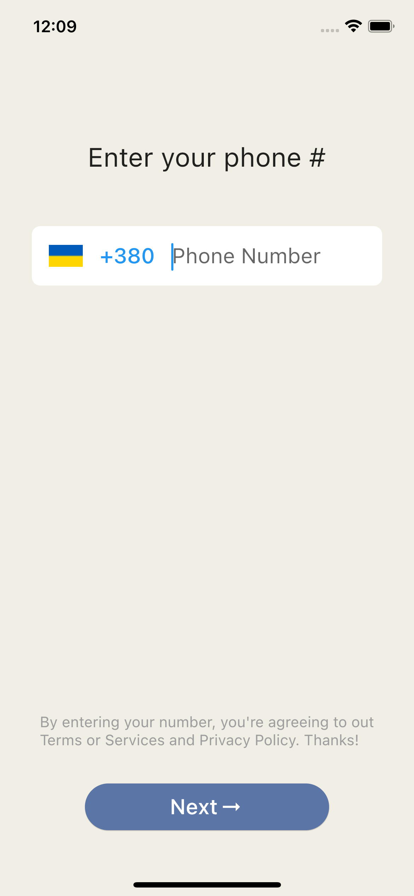
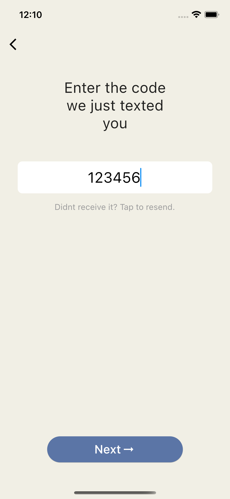
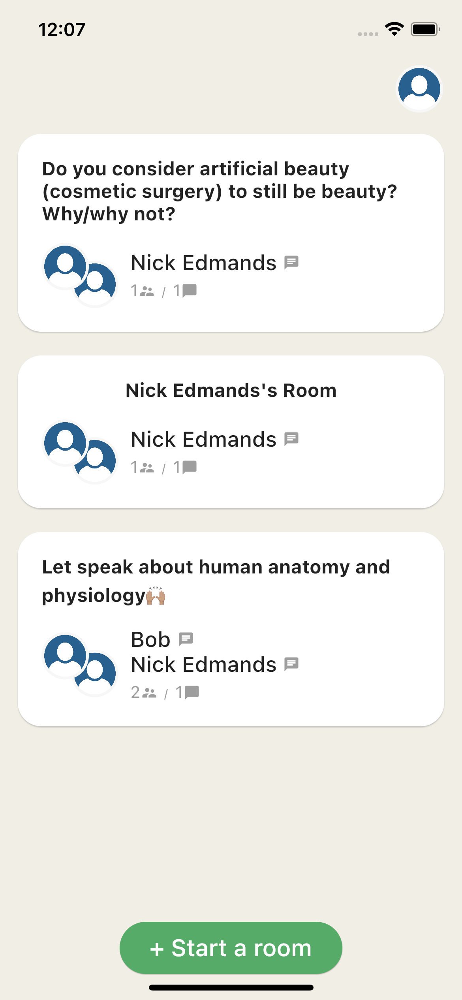
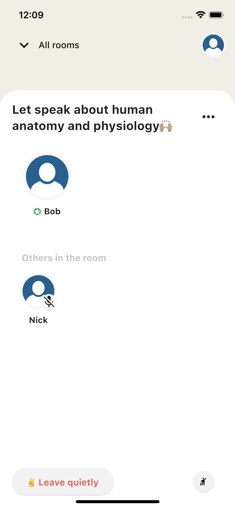

# Clubhouse

Clubhouse clone built on Flutter using Firebase and Agora services.

## Preview

 
 
 
  

## Packages
* agora_rtc_engine: https://pub.dev/packages/agora_rtc_engine

* permission_handler: https://pub.dev/packages/permission_handler

* firebase_auth: https://pub.dev/packages/firebase_auth

* cloud_firestore: https://pub.dev/packages/cloud_firestore

* country_code_picker : https://pub.dev/packages/country_code_picker

* pull_to_refresh : https://pub.dev/packages/pull_to_refresh

