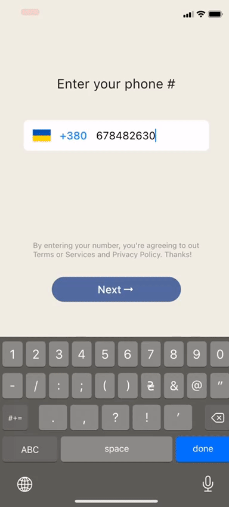
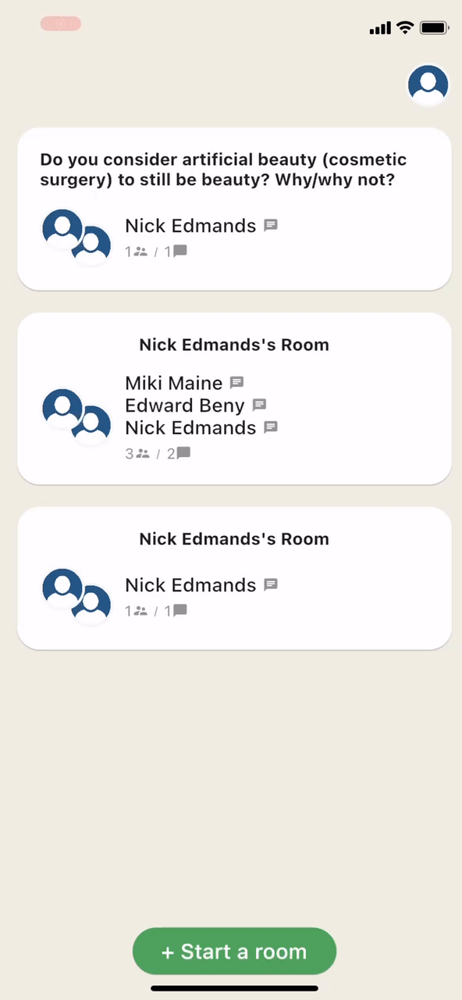

# Clubhouse

Clubhouse clone written in Flutter using Firebase/Firestore and Agora services.

## See our tutorial posts:

Part 1 - [Setup Flutter project and create Clubhouse clone app UI](https://perpet.io/blog/how-to-build-a-clubhouse-clone-app-with-flutter-a-tutorial-by-perpetio-part-i/)

Part 2 - [User login and registration with Firebase](https://perpet.io/blog/how-to-build-a-clubhouse-clone-app-with-flutter-a-tutorial-by-perpetio-part-ii/)

Part 3 - [Voice calling functionality with Agora](https://perpet.io/blog/how-to-build-a-clubhouse-clone-app-with-flutter-a-tutorial-by-perpetio-part-iii/)


## Preview
<p align="center">
 
 
 
</p>


## Dependencies
* agora_rtc_engine: https://pub.dev/packages/agora_rtc_engine

* permission_handler: https://pub.dev/packages/permission_handler

* firebase_auth: https://pub.dev/packages/firebase_auth

* cloud_firestore: https://pub.dev/packages/cloud_firestore

* country_code_picker : https://pub.dev/packages/country_code_picker

* pull_to_refresh : https://pub.dev/packages/pull_to_refresh


## Getting started

#### 1. [Setup Flutter](https://flutter.dev/docs/get-started/install).

#### 2. Clone the repo.

```sh
$ git clone https://github.com/perpetio/clubhouse.git
```

#### 3. Run `flutter pub get`.

#### 4. Setup the Firebase App. Follow instructions:

1. Create your own Firebase project.

2. Once your Firebase instance is created, you'll need to enable Phone authentication.

* Go to the Firebase Console for your new instance.
* Click "Authentication" in the left-hand menu
* Click the "sign-in method" tab
* Click "Phone" and enable it

3. Enable the Firestore Database
* Go to the Firebase Console
* Click "Firestore Database" in the left-hand menu
* Click the Cloudstore "Create Database" button
* Select "Start in test mode" and "Enable"

4. Add the google-services.json to the folder android/app (for Android) and GoogleService-Info.plist into the root of your Xcode project to all targets(for IOS).

#### 5. Setup the Agora. Follow instructions:
* Create a developer account at agora.io. Once you finish the sign-up process, you are redirected to the dashboard
* Navigate in the dashboard tree on the left to Projects > Project List.
* Find your app ID on the Agora dashboard and copy it to your clipboard. Then, generate a temporary token from the Agora console page.
* Replace the const in the settings.dart file in the <project>/lid/core folder.
 ```
 const APP_ID = '';
 const Token = '';
 const channelName = '';

 ```

#### 6. Run the project using `flutter run` or using your IDE's tools.
